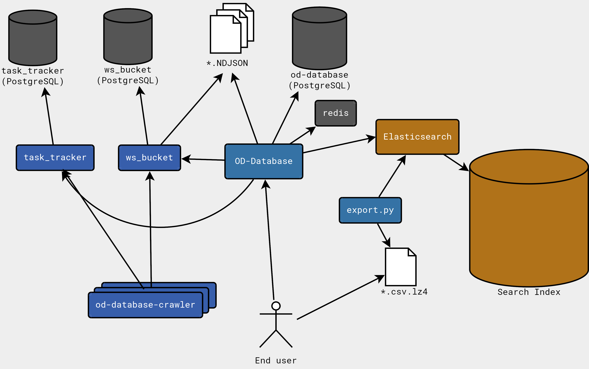

# OD-Database

OD-Database is a web-crawling project that aims to index a very large number of file links and their basic metadata from open directories (misconfigured Apache/Nginx/FTP servers, or more often, mirrors of various public services).

Each crawler instance fetches tasks from the central server and pushes the result once completed. A single instance can crawl hundreds of websites at the same time (Both FTP and HTTP(S)) and the central server is capable of ingesting thousands of new documents per second. 

The data is indexed into elasticsearch and made available via the web frontend (Currently hosted at https://od-db.the-eye.eu/). There is currently ~1.93 billion files indexed (total of about 300Gb of raw data). The raw data is made available as a CSV file [here](https://od-db.the-eye.eu/dl).


### Contributing   
Suggestions/concerns/PRs are welcome

## Installation (Docker)
```bash
git clone https://github.com/simon987/od-database
cd od-database
docker-compose up
```

## Architecture



## Running the crawl server
The python crawler that was a part of this project is discontinued,
[the go implementation](https://github.com/terorie/od-database-crawler) is currently in use.

### Configure Elasticsearch
```
PUT _template/default
{
  "index_patterns": ["*"],
  "order": -1,
  "settings": {
    "number_of_shards": "50",
    "number_of_replicas": "0",
    "codec" : "best_compression",
    "routing_partition_size" : 5
  }
}
